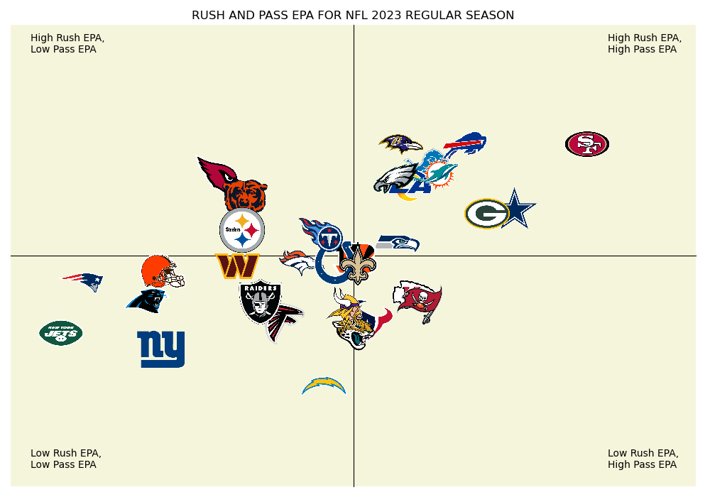

# **Gridiron Efficiency: Visualizing NFL Rush and Pass EPA 🏈**

## Overview

This documentation explains the process of creating a quadrant scatter plot  for the pass and rush Expected Points Added (EPA) of every NFL team in the 2023 regular season. This visualisation provides insights into each team's offensive strategy and overall performance.

## Key Terminologies
**Expected Points Added (EPA):** Expected Points Added, commonly referred to as EPA, is a measure of how well a team performs relative to expectation
**Rush:** Rushing is an action taken by the offense, usually the running back, that means to advance the ball by running with it
**Pass:** Passing is an action taken by the offense, usually the quarterback, that means to advance the ball by throwing it to a teammate


## Tools and Technologies Used

**Python:** The primary programming language for data analysis and visualisation.
**Pandas:** A powerful data manipulation library for handling and processing the dataset.
**Matplotlib:** A popular data visualisation library in Python for creating the scatter plot.
**OS:** A Python module that provides a portable way of using operating system-dependent functionality to work with file paths.
**Urllib.request:** An extensible Python library for opening URLs (Uniform Resource Locators).

## Data Source

The dataset used for this visualisation includes the pass and rush EPA values for each NFL team in the 2023 regular season. The data was obtained from the [nfl_data_py](https://pypi.org/project/nfl-data-py/) python Library used for interacting with NFL data sourced from nflfastR, nfldata, dynastyprocess, and Draft Scout. For more information, check out the [cooperdff](https://github.com/cooperdff/nfl_data_py) Github repository.

## Steps

### 1. Installation

Use the package manager **pip** to install nfl_data_py.

```
pip install nfl_data_py
```

### 2. Importing and Loading the Data

To import the data:
```
import nfl_data_py as nfl
```
To load the data:
```
#Loading 2023 play by play dataset
pbp = nfl.import_pbp_data([2023])
```
### 3. Understanding the data

The NFL Python library contains game-by-game statistics for each club and player, as well as weekly and seasonal data collections and roster information. To understand the data, some exploratory data analysis was conducted using the play-by-play data from the module.
```
# Number of rows and columns of the 
pbp.shape

# Displaying the first 5 rows of the data
pbp.head()

# Displaying all columns of the dataset
nfl.see_pbp_cols()

# Displaying the data types present in the data
pbp.dtypes
```

### 4. Data Preparation

The dataset includes data on every player and team that participated in the 2023 NFL regular season, arranged into different columns. The only data that is necessary is that related to the **run** and **pass** EPAs; all other data is filtered out. 

```
#Filter to include the pass and rush data and drop columns that's not needed
pbp_RP = pbp[(pbp['pass'] == 1) | (pbp['rush'] == 1)]
pbp_RP = pbp_RP.dropna(subset = ['epa', 'posteam', 'defteam'])
pbp_RP
```
To create the visualisation, some crucial data is required, including **pass_epa**, **rush_epa**, and the names of the teams. New tables are created for the rush and pass EPA once the data has been filtered, and both tables are then combined.


```
#Group together the team and pass epa data into a new table
pass_epa = pbp_RP[(pbp['pass'] == 1)].groupby('posteam')['epa'].mean().reset_index().rename(columns = {'epa' : 'pass_epa'})
pass_epa.sort_values('pass_epa', ascending = False)

#Group together the team and rush epa data into a new table
rush_epa = pbp_RP[(pbp['rush'] == 1)].groupby('posteam')['epa'].mean().reset_index().rename(columns = {'epa' : 'rush_epa'})
rush_epa.sort_values('rush_epa', ascending = False)

#Merge both pass and rush epa tables
epa = pd.merge(pass_epa, rush_epa, on = 'posteam')
epa
```

The data is ready to use at this stage, but each team's logo is shown on the chart to enhance its visual appeal. To do this, the team abbreviation, **team_abbr** and logo images, **team_logo_espn**, are imported from the **nfl** library, added to a list, and a loop is made to fetch all team abbreviations and logo paths, which hold all of the logo images. The team abbreviation and logo table are combined with the pass and rush EPA table.

```
#Import the team abbreviations and logo from the nfl_data_py library 
logos = nfl.import_team_desc()[['team_abbr', 'team_logo_espn']]
logos.head()

#Create a list for both the logo path and the team abbreviations
logo_paths = []
team_abbr = []

if not os.path.exists("logos"):
    os.makedirs("logos")

#Create a loop to retrieve all team abbreviations and logo path in .tif image format and append them into the list earlier create     
for team in range(len(logos)):
    urllib.request.urlretrieve(logos['team_logo_espn'][team], f"logos/{logos['team_abbr'][team]}.tif")
    logo_paths.append(f"logos/{logos['team_abbr'][team]}.tif")
    team_abbr.append(logos['team_abbr'][team])

data = {'team_abbr' : team_abbr, 'logo_path' : logo_paths}
logo_data = pd.DataFrame(data)

#Merge the pass and rush epa table with the team abbreviation and logo path table
epa_with_logos = pd.merge(epa, logo_data, left_on = 'posteam', right_on = 'team_abbr')
epa_with_logos
```

### 5. Creating the Quadrant Scatter Plot

The quadrant scatter plot was created using Matplotlib to visualise each NFL team's pass and rush EPA. Teams were positioned in four quadrants based on their EPA values, providing a clear overview of their offensive performance.

```
#Use the team logos to plot the pass and rush epa
plt.rcParams["figure.figsize"] = [10, 7]
plt.rcParams['figure.autolayout'] = True

def getImage(path):
    return OffsetImage(plt.imread(path, format = 'tif'), zoom = .1)

x = epa_with_logos['pass_epa']
y = epa_with_logos['rush_epa']
paths = epa_with_logos['logo_path']

fig, ax = plt.subplots()

for x0, y0, path in zip(x, y, paths):
    ab = AnnotationBbox(getImage(path), (x0, y0), frameon= False)
    ax.add_artist(ab)

#Drawing the quadrants, y and x axis
ax.spines['left'].set_position('center')
ax.spines['bottom'].set_position('center')
ax.spines['right'].set_color('none')
ax.spines['top'].set_color('none')

#Creating the legend
plt.annotate('High Rush EPA,\nHigh Pass EPA', (0.31,0.12),fontsize = 10)
plt.annotate('High Rush EPA,\nLow Pass EPA', (-0.28,0.12),fontsize = 10)
plt.annotate('Low Rush EPA,\nHigh Pass EPA', (0.31,-0.33),fontsize = 10)
plt.annotate('Low Rush EPA,\nLow Pass EPA', (-0.28,-0.33),fontsize = 10)
ax.set_facecolor("#F5F5DC")
plt.xlim((-0.3,0.4))
plt.ylim((-0.35,0.15))
plt.title("RUSH AND PASS EPA FOR NFL 2023 REGULAR SEASON")
plt.xticks([])
plt.yticks([])
plt.savefig("NFL_EPA.png")
plt.show()
```



### 6. Interpretation

The quadrant scatter plot allows for a quick interpretation of each team's offensive strategy:

**Top-Right Quadrant:** Teams with high pass and rush EPA, indicating a balanced and effective offensive strategy.
**Top-Left Quadrant:** Teams with high rush EPA but lower pass EPA, suggesting a run-heavy offensive approach.
**Bottom-Right Quadrant:** Teams with high pass EPA but lower rush EPA, indicating a pass-heavy offensive strategy.
**Bottom-Left Quadrant:** Teams with lower pass and rush EPA, signifying a need for improvement in both aspects.

### Conclusion
This Python project uses NFL play-by-play data from the 2023 regular season to create a quadrant scatter plot to visualize offensive efficiency of each team. It examines pass and rush Expected Points Added (EPA) to understand each team's strategic tendencies and overall performance. The visualization emphasizes the importance of balance in offensive strategies, as overreliance on either can limit a team's effectiveness. This project provides valuable insights for coaches, analysts, and fans, contributing to a deeper understanding of the game and its strategic nuances.